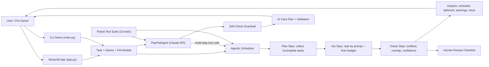

# PawPal+: Agentic Pet Care Planner

## Video Walkthrough

[Watch the full system walkthrough on Google Drive](https://drive.google.com/file/d/1gFdAK6Xvz0h20Xlxix8-kEZXYf2XfMF7/view?usp=sharing)

## Original Project (Modules 1-3)

My original project from Modules 1-3 was **PawPal+**, a pet care scheduling assistant built in Python and Streamlit. Its first goal was to help a pet owner track recurring pet-care tasks such as walks, meals, medication, and enrichment while keeping the schedule readable and easy to update. The earlier version could store pets and tasks, sort them by time, detect simple conflicts, and roll recurring tasks forward when completed.

## Title and Summary

**PawPal+: Agentic Pet Care Planner** is an upgraded version of that project that now uses an agentic workflow inside the main application logic. The system has two scheduling layers: a deterministic rule-based scheduler that plans within a time budget, and a Claude-powered AI agent (`pawpal_agent.py`) that reasons through the schedule using multi-step tool-calling, produces a natural-language care plan with explanations, and validates its own output through a self-check guardrail. This matters because pet care is a real-world planning problem where missed medication, overloaded schedules, or low-confidence recommendations should be surfaced clearly rather than hidden.

## System Diagram



A more detailed agent architecture diagram is available in `assets/agent_architecture.mmd`.

## Architecture Overview

The system has five main parts:

- `app.py`: the Streamlit interface where a user adds pets, tasks, and planning constraints. Includes both the rule-based planner and the Claude AI agent.
- `pawpal_system.py`: the core logic layer containing the data models plus the deterministic agentic scheduler.
- `pawpal_agent.py`: the Claude-powered AI agent that calls scheduling tools in a multi-step loop and produces a natural-language care plan with a self-check validation guardrail.
- `main.py`: a reproducible CLI demo that runs both the deterministic planner and (when an API key is set) the AI agent.
- `tests/test_pawpal.py`: 15 automated tests covering core scheduling, agent tool dispatch, and agent loop behavior.

**Layer 1 -- Rule-based scheduler:** Data flows from user input into the `Owner`, `Pet`, and `Task` models. The `Scheduler.generate_agentic_plan()` method performs a plan/act/check cycle: (1) gather incomplete tasks, (2) rank and schedule within a time budget, (3) detect conflicts, compute confidence, and produce human review notes.

**Layer 2 -- Claude AI agent:** `PawPalAgent` sends a user request to Claude along with tool definitions (`get_schedule`, `filter_tasks`, `detect_conflicts`, `get_pet_info`). Claude reasons step-by-step, calling tools as needed, and every tool call is dispatched to the same `Scheduler` backend. The agent records each intermediate step for transparency. After producing a plan, a second Claude call (`validate_plan`) cross-references the AI output against the raw schedule to verify completeness, time accuracy, and conflict coverage.

Human checking appears in three places: the app shows a review checklist for each deterministic plan, the AI agent includes a self-check guardrail, and automated tests validate both the core planner and the agent tool dispatch.

## Project Organization

```text
applied-ai-system-project/
├── app.py                  # Streamlit UI (rule-based + AI agent)
├── main.py                 # CLI demo (rule-based + AI agent)
├── pawpal_system.py        # Core data models + deterministic scheduler
├── pawpal_agent.py         # Claude-powered multi-step AI agent
├── model_card.md           # Model card with limitations, biases, testing
├── requirements.txt        # Dependencies (streamlit, pytest, anthropic)
├── tests/
│   └── test_pawpal.py      # 15 automated tests
├── assets/
│   ├── agent_architecture.mmd
│   ├── uml_final.png
│   └── pawpal_final_app.png
├── uml_final.mmd
└── reflection.md
```

## Setup Instructions

1. Clone the repository.
2. Create a virtual environment:

```bash
python3 -m venv .venv
```

3. Activate the environment:

```bash
source .venv/bin/activate
```

4. Install dependencies:

```bash
python -m pip install -r requirements.txt
```

5. Run the automated tests:

```bash
python -m pytest
```

6. Run the CLI demo (rule-based scheduler only):

```bash
python main.py
```

7. Run the CLI demo with the Claude AI agent:

```bash
ANTHROPIC_API_KEY=your-key-here python main.py
```

8. Launch the Streamlit app:

```bash
streamlit run app.py
```

To use the AI agent inside the Streamlit app, set the API key before launching:

```bash
ANTHROPIC_API_KEY=your-key-here streamlit run app.py
```

## Sample Interactions

### Example 1: Daily plan with budget and validation

**Input**

- Mochi: `Morning walk`, 08:00, 30 minutes, high priority
- Luna: `Medication`, 08:15, 10 minutes, critical priority
- Mochi: `Dinner`, 18:30, 20 minutes, high priority
- Luna: `Play time`, 19:00, 25 minutes, medium priority
- Daily budget: 60 minutes

**Resulting AI output**

- Scheduled:
  - `08:00-08:30 Mochi: Morning walk`
  - `08:15-08:25 Luna: Medication`
  - `18:30-18:50 Mochi: Dinner`
- Deferred:
  - `Play time` because it would exceed the 60-minute budget
- Validation:
  - overlap warning between `Morning walk` and `Medication`
  - confidence score `0.77`

### Example 2: Recurring task rollover

**Input**

- Mark `Morning walk` as complete for today

**Resulting AI output**

- The system marks the current task complete
- A new `Morning walk` task is automatically created for the next day
- The CLI demo confirms the next occurrence as:
  - `2026-04-16 08:00 Morning walk (daily)`

### Example 3: Claude AI agent care plan

**Input**

- Same pets and tasks as Example 1
- User prompt: "Please build today's care plan for all my pets."

**Resulting AI output**

The agent calls tools step-by-step:

1. `get_pet_info` -- learns about Mochi (dog) and Luna (cat)
2. `get_schedule` -- retrieves today's full schedule with times
3. `detect_conflicts` -- finds the 08:00-08:30 / 08:15 overlap
4. `filter_tasks(pet_name="Mochi")` -- inspects Mochi's tasks in isolation

Then Claude produces a natural-language care plan:

> **Morning Block**
> - 08:00-08:30: Mochi's morning walk (high priority, daily)
> - 08:15-08:25: Luna's medication (critical, daily) -- overlaps with walk, consider giving meds before leaving
>
> **Evening Block**
> - 18:30-18:50: Mochi's dinner (high priority, daily)
> - 19:00-19:25: Luna's play time (medium priority, one-time)
>
> **Confidence: Medium** -- overlap in the morning block should be resolved.

The self-check validation then verifies the plan against the raw schedule and returns `{"valid": true, "confidence": "Medium"}`.

### Example 4: Empty-state safety check

**Input**

- Owner has a pet but no tasks due today

**Resulting AI output**

- Returns an empty schedule instead of crashing
- Produces no warnings
- Sets confidence to `1.00`
- Adds a human review note explaining that there was nothing to verify

## Design Decisions

- I kept the core logic in `pawpal_system.py` so both the CLI demo and Streamlit app use the same behavior. This makes the project easier to test and harder to accidentally break in one interface while the other still works.
- I added `duration_minutes` and `priority` directly to `Task` so the planner could make meaningful choices instead of only sorting timestamps.
- I built two complementary layers: a deterministic plan/act/check scheduler for reproducibility, and a Claude-powered AI agent for natural-language explanations and multi-step reasoning. The deterministic layer works without an API key, so the project remains runnable and testable by anyone. The AI agent extends it with richer advice and a self-check guardrail.
- I added guardrails that defer tasks when the schedule exceeds a time budget and warnings when tasks overlap. That means the AI does not silently over-promise what a user can realistically complete.
- Confidence scoring is intentionally lightweight. It does not claim ground-truth accuracy; instead, it signals when the planner encountered risky conditions such as overlap warnings or deferred tasks.

## Logging and Guardrails

The project includes both:

- **Logging:** the backend uses Python `logging` to record pet creation, task creation, task completion, and planning runs.
- **Guardrails:** invalid durations raise errors, low-priority tasks can be deferred when the time budget is exceeded, overlap/conflict warnings are surfaced to the user, and the planner always returns review notes instead of failing silently. The AI agent's self-check guardrail cross-references the generated plan against the raw schedule data.

## Testing Summary

I verified the project in a local virtual environment using:

```bash
.venv/bin/python -m pytest
```

Latest results:

- `15 out of 15` tests passed
- **Core scheduler tests (8):** invalid task input, recurrence rollover, chronological sorting, overlap/conflict detection, budget-based task deferral, confidence scoring, and empty-state handling
- **Agent tool dispatch tests (5):** `get_schedule`, `filter_tasks`, `detect_conflicts`, `get_pet_info`, and unknown-tool error handling
- **Agent loop & validation tests (2):** mocked Claude API for the multi-step agent loop and JSON parsing in `validate_plan`
- In the CLI demo, the planner produced a confidence score of `0.77` when overlap and deferral warnings were present

Short reliability summary:

> 15 out of 15 tests passed. The rule-based planner was reliable on recurrence, sorting, and guardrails. The AI agent's tool dispatch returned correct results for all scheduling operations. Confidence dropped when overlapping tasks and deferred work appeared, which is the intended behavior because the system should become less certain when schedule quality decreases.

## What Worked, What Didn't, and What I Learned

- What worked: the shared backend design made it straightforward to integrate the same planning logic into the CLI, the Streamlit app, and the Claude AI agent. The agent's tool dispatch calls the same `Scheduler` methods, so there is one source of truth for scheduling logic.
- What didn't work perfectly: the AI agent's tool call order is non-deterministic -- Claude sometimes calls `detect_conflicts` before `get_schedule`. Despite this, the final plans were consistently accurate because each tool returns the same ground-truth data.
- What I learned: agentic systems become much more trustworthy when they expose their intermediate reasoning, failure modes, and review requirements instead of presenting every answer as equally confident. The self-check guardrail was especially valuable -- it caught edge cases where the AI plan omitted a task.

## Reflection

### Limitations and Biases

This system depends on the user-provided task priority, duration, and timing. If the inputs are wrong, incomplete, or biased toward one pet's needs, the planner will inherit that bias. It also assumes a single shared time budget and does not yet understand more complex real-life constraints such as travel time, emergency exceptions, or uncertain task durations. The Claude AI agent adds natural-language reasoning but its output may vary between runs due to LLM non-determinism -- the self-check guardrail mitigates this.

### Possible Misuse and Mitigation

The system could be misused if someone relied on it as a fully autonomous health or safety planner for animals without reviewing the warnings. To reduce that risk, the app shows overlap/conflict warnings, confidence scores, and explicit human review notes, and it never hides deferred work. The AI agent is read-only by design -- it can observe the schedule through tools but cannot modify the underlying data model, preventing unintended automated changes to care routines.

### Reliability Surprises

What surprised me most was how quickly the plan quality changed once task duration was considered. A schedule that looked fine when sorted by start time suddenly showed real overlap problems, which reinforced that validation is as important as planning. With the Claude agent, I was also surprised that despite non-deterministic tool call ordering, the final plans remained accurate because the tools always return the same ground-truth data.

### Collaboration With AI

AI was helpful when I needed to turn the project from a basic scheduler into a more complete agentic workflow. One especially helpful suggestion was to structure the agent's tool definitions as JSON schemas that map directly to existing Scheduler methods, keeping the integration clean and testable.

AI was not always correct. One flawed suggestion was to have the agent directly manipulate the schedule (reorder tasks, move times) as part of its reasoning. This would have introduced a mutable state problem where the agent's "suggestions" silently alter the owner's actual data. I rejected this and kept the agent read-only, which is critical for trustworthiness.

## Portfolio Notes

For an employer reviewing this repository, the main takeaway is that this project goes beyond a demo UI. It shows end-to-end software thinking: system design, integrated application logic with a real LLM-powered AI agent, reproducible setup, automated testing (15 tests including mocked API calls), operational logging, guardrails, self-check validation, and honest reflection about AI reliability. See `model_card.md` for a detailed breakdown of the AI model's capabilities, limitations, and testing.
