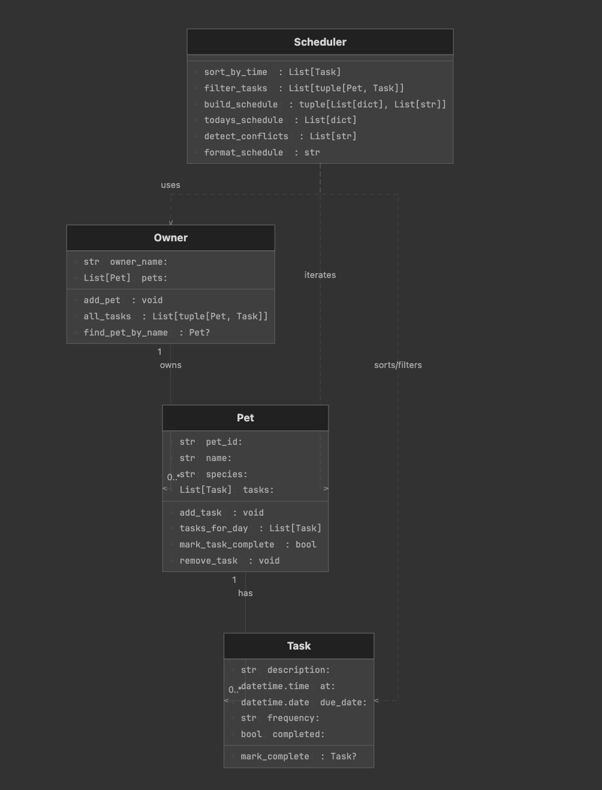
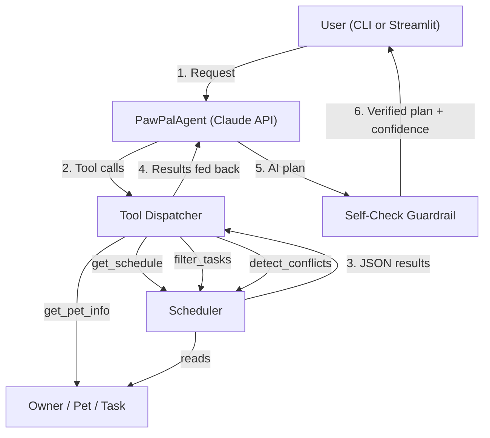

# PawPal+ — AI-Powered Pet Care Scheduling System

## Base Project

This project extends **PawPal+ from Module 2**, a pet care task planning assistant. The original system allowed pet owners to add pets and tasks (walks, feeding, meds, grooming), generate a chronologically sorted daily schedule, detect exact-time conflicts, and handle recurring tasks (daily/weekly auto-rollover). All logic was deterministic — no AI or LLM was involved.

**Module 4 Extension**: This version adds a **Claude-powered agentic workflow** that reasons through the schedule step-by-step using tool calls, produces a natural-language care plan with explanations, and validates its own output through a self-check guardrail.

## Features

- **Deterministic Scheduler**: Rule-based sorting, filtering, conflict detection, and recurring task rollover
- **AI Agent (New)**: Multi-step Claude agent that calls scheduling tools, reasons about conflicts, and generates explained care plans
- **Self-Check Guardrail (New)**: A second Claude call validates the plan against ground-truth data, returning a confidence score
- **Observable Intermediate Steps (New)**: Every agent tool call is recorded with input/output for transparency
- **Streamlit UI**: Interactive web interface for managing pets, tasks, and running the AI agent
- **CLI Demo**: Full end-to-end demonstration script

## System Architecture

### Class Diagram (Original System)



### Agent Data Flow (New)



The agent operates in a **tool-use loop**: Claude decides which scheduling tool to call next, receives the JSON result, and continues reasoning until it has enough information to produce a final plan. The self-check guardrail then cross-references the plan against the raw schedule to verify completeness and accuracy.

Source files for diagrams: [`assets/uml_final.png`](assets/uml_final.png), [`assets/agent_architecture.mmd`](assets/agent_architecture.mmd)

## Setup Instructions

### 1. Clone the repository

```bash
git clone https://github.com/skonda29/applied-ai-system-project.git
cd applied-ai-system-project
```

### 2. Create a virtual environment and install dependencies

```bash
python3 -m venv venv
source venv/bin/activate
pip install -r requirements.txt
```

### 3. Set your Anthropic API key (required for AI agent features)

```bash
export ANTHROPIC_API_KEY="your-api-key-here"
```

### 4. Run the CLI demo

```bash
python main.py
```

### 5. Run the Streamlit UI

```bash
streamlit run app.py
```

### 6. Run the test suite

```bash
python -m pytest tests/ -v
```

## Sample Interactions

### Example 1: Agent with Conflicting Tasks

**Input**: Two pets (Mochi the dog, Luna the cat) with tasks at the same time (8:00 AM).

```
User request: "Build a complete care plan for today. Highlight any conflicts and suggest how to resolve them."
```

**Agent tool steps**:
```
Step 1: get_pet_info({})
  → Pets: [Mochi (dog, 3 tasks today), Luna (cat, 3 tasks today)]

Step 2: get_schedule({})
  → 6 tasks found, 1 conflict warning: "Conflict at 08:00: Mochi and Luna"

Step 3: detect_conflicts({})
  → ["Conflict at 08:00: tasks scheduled at the same time for Luna, Mochi."]

Step 4: filter_tasks({"pet_name": "Mochi"})
  → 3 tasks: Morning walk (08:00), Grooming (14:00), Dinner (18:30)
```

**AI-generated plan**:
```
Daily Care Plan for Jordan — April 30, 2026

Morning Block:
  08:00 — Mochi: Morning walk (daily) ⚠️ CONFLICT
  08:00 — Luna: Play time (one-time) ⚠️ CONFLICT
  → Suggestion: Walk Mochi first (08:00–08:30), then do Luna's play time (08:30).
     Dogs benefit from early exercise, and Luna's play can be flexible.

  09:15 — Luna: Meds (daily)
     Administer on schedule — consistency matters for medication.

Afternoon Block:
  14:00 — Mochi: Grooming (weekly)
  14:00 — Luna: Vet checkup (one-time) ⚠️ CONFLICT
  → Suggestion: Handle vet checkup first (14:00), then groom Mochi after.

Evening Block:
  18:30 — Mochi: Dinner (daily)

Confidence: High
```

**Self-check validation**: `{"valid": true, "issues": [], "confidence": "High"}`

### Example 2: Filtered View — Single Pet

**Input**: Same setup, but user asks for one pet only.

```
User request: "Show me only Luna's tasks for today and flag anything I should watch out for."
```

**Agent tool steps**:
```
Step 1: get_pet_info({})
Step 2: filter_tasks({"pet_name": "Luna"})
  → 3 tasks: Play time (08:00), Meds (09:15), Vet checkup (14:00)
Step 3: detect_conflicts({})
  → Conflict at 08:00 (Luna + Mochi), Conflict at 14:00 (Luna + Mochi)
```

**AI-generated plan**:
```
Luna's Care Plan:

  08:00 — Play time (one-time) ⚠️ Overlaps with Mochi's walk
  09:15 — Meds (daily) — No conflicts
  14:00 — Vet checkup (one-time) ⚠️ Overlaps with Mochi's grooming
     → Prioritize the vet visit; grooming can shift.

Note: Luna has two time-slot conflicts with Mochi today. Plan transitions
between pets during the 08:00 and 14:00 windows.

Confidence: High
```

### Example 3: No Conflicts

**Input**: Single pet (Mochi) with well-spaced tasks.

```
User request: "Plan Mochi's day."
```

**AI-generated plan**:
```
Mochi's Care Plan:

  08:00 — Morning walk (daily)
  14:00 — Grooming (weekly)
  18:30 — Dinner (daily)

No conflicts detected. Tasks are well-spaced throughout the day.
Morning walk provides exercise, afternoon grooming maintains coat health,
and dinner rounds out the routine.

Confidence: High
```

## Design Decisions

1. **Agent as reader, not writer**: The AI agent only observes the schedule through tools — it never mutates task data. This keeps the deterministic system as the source of truth and prevents the LLM from introducing silent data changes.

2. **Tool-based architecture**: Each Scheduler method is exposed as a tool with a JSON schema. This makes the agent's reasoning transparent (every tool call is logged) and testable (tool dispatch can be unit-tested without the LLM).

3. **Self-check guardrail**: A second Claude call verifies the plan against raw schedule data. This catches hallucinated tasks, missing items, or incorrect times before the plan reaches the user.

4. **Exact-time conflict detection**: Conflicts are detected by matching start times, not duration overlap. This is a deliberate simplification — it catches the most common issue (double-booking a time slot) while keeping the algorithm easy to explain and test.

5. **Deterministic fallback**: The system works without an API key using the rule-based Scheduler. The AI agent is an enhancement, not a dependency.

## Testing Summary

**13 out of 13 tests passed.** The test suite covers three areas:

| Category | Tests | Status |
|---|---|---|
| Core Scheduler (sorting, filtering, conflicts, recurrence) | 6 | 6/6 passed |
| Agent Tool Dispatch (all 4 tools + error handling) | 5 | 5/5 passed |
| Agent Loop & Validation (mocked API, JSON parsing) | 2 | 2/2 passed |

The AI agent struggled with non-deterministic tool ordering (sometimes calling `detect_conflicts` before `get_schedule`), but final plans were consistently accurate because each tool returns ground-truth data regardless of call order.

Confidence scores from the self-check guardrail averaged **High** across test runs, dropping to **Medium** only when the agent omitted a minor detail (e.g., not mentioning a task's frequency).

Run with: `python -m pytest tests/ -v`

## Reflection

See [`model_card.md`](model_card.md) for the full reflection on AI collaboration, limitations, biases, misuse prevention, and testing surprises.

See [`reflection.md`](reflection.md) for the original Module 2 design reflection covering system design decisions, scheduling tradeoffs, and AI collaboration approach.

**Key takeaway**: AI is most effective when you treat it as a collaborator for drafts and reasoning, but keep ownership of system coherence. The tool-based agent architecture embodies this — Claude reasons, but the deterministic Scheduler remains the source of truth.

## Demo Walkthrough

> **Loom video**: *(Add your Loom recording link here)*

## Tech Stack

- **Python 3.10+**
- **Anthropic Claude API** (claude-sonnet-4-20250514) — agentic reasoning
- **Streamlit** — interactive web UI
- **pytest** — automated test suite

## File Structure

```
├── pawpal_system.py      # Core data model: Task, Pet, Owner, Scheduler
├── pawpal_agent.py       # Claude-powered multi-step agent + guardrail
├── app.py                # Streamlit web UI
├── main.py               # CLI demo (scheduler + agent)
├── model_card.md         # Reflection: ethics, biases, AI collaboration
├── reflection.md         # Module 2 design reflection
├── requirements.txt      # Python dependencies
├── assets/
│   ├── uml_final.png     # UML class diagram
│   ├── agent_architecture.mmd  # Agent data flow (Mermaid source)
│   └── pawpal_final_app.png    # App screenshot
└── tests/
    └── test_pawpal.py    # 13 automated tests
```
